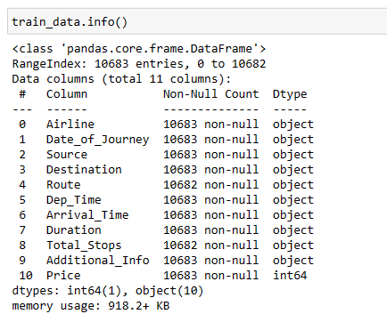
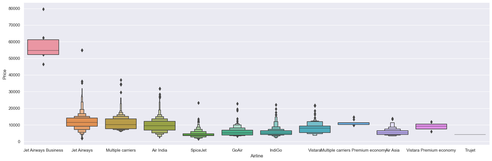
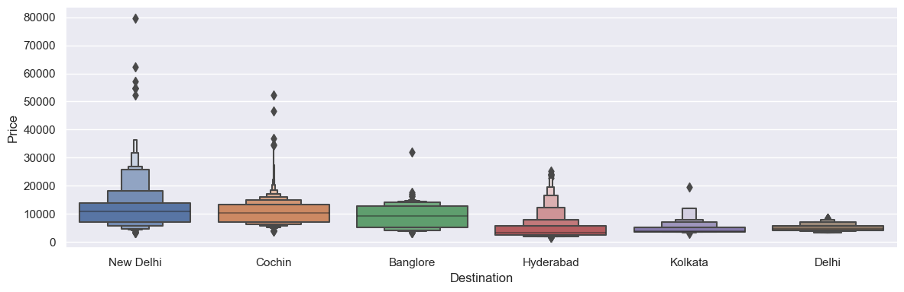
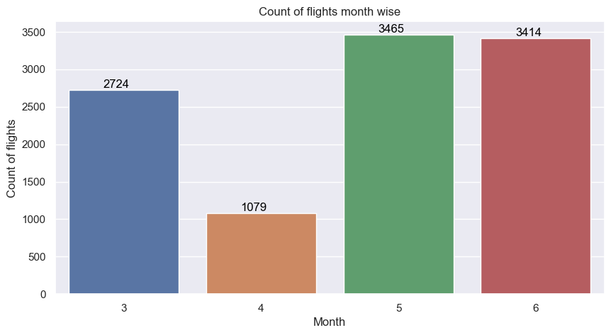
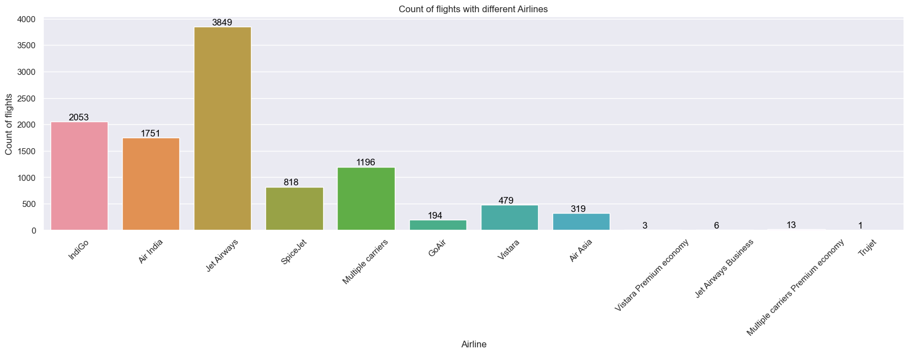
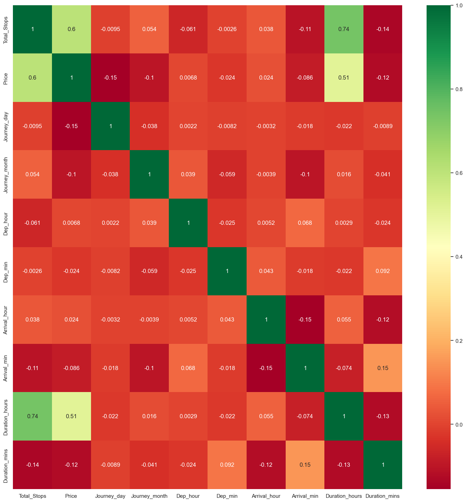
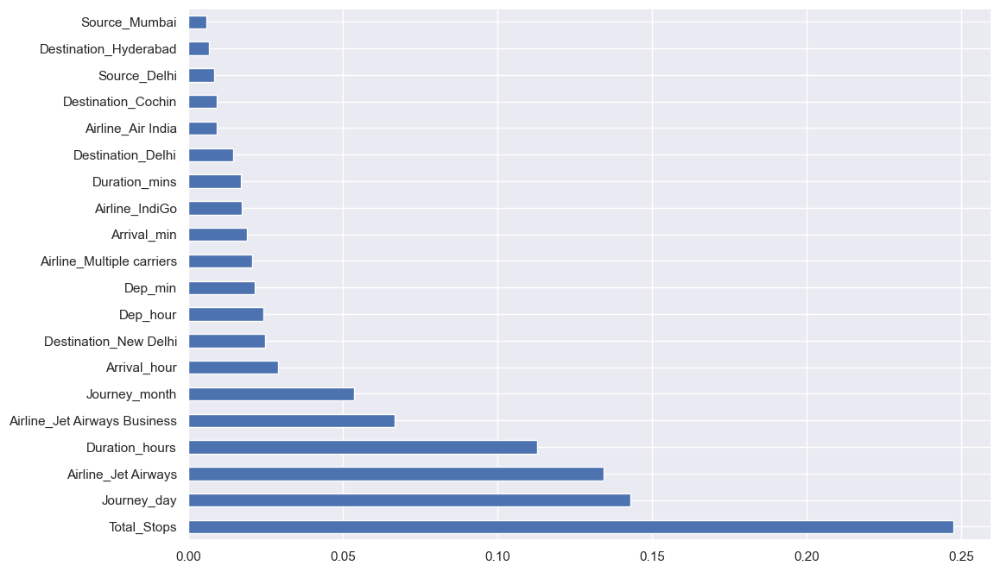

<!--  -->

# Flight Price Prediction 

## Table of Contents:
- [Problem Statement](#business-problem)
- [Data Source](#data-source)
- [Methods](#methods)
- [Tech Stack](#tech-stack)
- [Quick Glance At The Results](#quick-glance-at-the-results)
- [Limitations & What Can Be Improved](#limitations-and-what-can-be-improved)
- [Explore The Notebook](#explore-the-notebook)
- [Deployment On Heroku](#deployment-on-heroku)
- [App Deployed On Heorku](#app-deployed-on-heroku)

## Problem Statement

## Data Source

## Methods

- Exploratory Data Analysis
- Data Visualization 
- Feature Engineering 
- One Hot Encoding 
- Hyperparameter Tuning
- Pickling
- Model Deployment 

## Tech Stack

- Python *(Refer to requirements.txt for the packages used in this project)*
- Heroku *(for deployment)*

## Quick Glance At The Results

**Information about the dataset:**

**Price vs Airline:**

*Inference:* Jet Airways has the most outliers in terms of price.

**Price vs Destination:**

*Inference:* New Delhi has the most outliers and Kolkata has the least. 

**Months vs Number of flights:**

*Inference:* May has the most number of flights

**Type of Airline vs Number of Flights**

*Inference:* Jet Airways has the most flight boarded

**Correlation between all features:**

**Feature Importance:**

## Limitations & What Can Be Improved

## Explore The Notebook

## Deployment On Heroku

## App Deployed On Heroku 

## Further Readings

<!-- https://www.vectorlogo.zone/logos/heroku/heroku-icon.svg -->